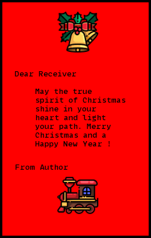

<h1 align="center">Xmas Card Generator

</h1>
<p align="center"><a></a>
<a href="https://GitHub.com/Naereen/"></a></p>

<h3 align="center">Automatically build Xmas cards with user inputs </h3>

```
pip install Pillow
```
<h3> Available Options </h3>
<ul>
<li>Text Color</li>
<li>Canvas Color</li>
<li>Canvas Border Color</li>
<li>Receiver Name</li>
<li>Author Name</li>
<li>Header Icons</li>
<li>Footer Icons</li>
<li>File name </li>
</ul>

<h3> Header Icon Options </h3>
<ul>
<li>Santa Hat</li>
<li>Xmas Tree</li>
<li>Xmas Bell</li>
<li>Xmas Boy</li>
<li>Xmas Girl</li>
<li>Xmas Gift</li>
<li>Santa with Deer</li>
<li>Decorate with Family</li>
<li>Tree with Couples</li>
</ul>

<h5><b>You can select header icons by inputting corresponding serial number</b></h5>

<h3> Footer Icon Options </h3>
<ul>
<li>Xmas Train</li>
<li>Xmas Sledge</li>
<li>Santa on Chair</li>
<li> Merry Christmas Logo</li>
</ul>

<h5><b>You can select footer icons by inputting corresponding serial number</b></h5>

<h3> Preview </h3>
<p></p>
<h5> <p>Thanks to <a href="https://icons8.com">Icons 8</a> &amp; <a href="https://icons8.com/icons/authors/3kSkbuAyjUdG/justicon">Justicon</a> &amp;  for the awesome icons ! </p> </h5>
<h5> <p> Thanks to <a href="https://www.fontfabric.com/fonts/nexa/"> Nexa Font Family </p>
<h5> <b> ⭐ Please star this repo if you like ! </b> </h5>
